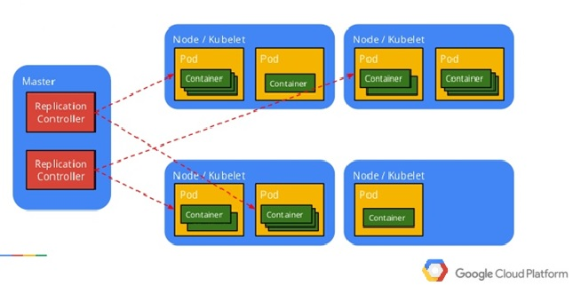

### Por que utilizar o Kubernetes?
 Com os recursos do Kubernetes, você consegue implantar containers em escala para essas cargas de trabalho e assim executar as demandas que são recebidas pelo cluster.

Além da orquestração de containers em vários hosts, o Kubernetes também possibilita outras coisas, como o melhor aproveitamento de hardware, controle das implantações e atualizações das aplicações, escalada das aplicações rapidamente em containers e, claro, gerenciar os serviços de forma que as aplicações sejam executadas da mesma maneira como foram implantadas.

O Kubernetes pode ser executado em várias plataformas, como no seu computador, VMs em um provedor de nuvem e em vários servidores. Os clusters podem abranger hosts em clouds públicas ou privadas.

### O que é um cluster?
Um cluster no Kubernetes é um grupo de maquinas que trabalham em conjunto para executar e gerenciar aplicativos em containers. O cluster inclui um nó mestre que controla o cluster e varios nós de trabalho que executam os aplicativos
 
### O que é um Nó(Node)?
Basicamente um node é uma maquina dentro do cluster que executa os pods e fornece os recursos necessarios para as cargas de trabalho. 

### O que é um Pod?
É uma unidade simples execução e implantação de containers, agrupando um ou mais containers em um unico nó. Podem ser gerenciados, escalados e removido de forma. Basicamente, pods são grupos de containers relacionados.

## Como funciona o deployment no kubernetes?
O deployment no Kubernetes é um recurso que facilita a gestão e a implantação de aplicativos. Ele define o estado desejado de um aplicativo em um cluster Kubernetes e garante que o cluster atinja esse estado.
Você começa criando um arquivo de configuração YAML N que descreve o deployment. Este arquivo inclui especificações como o número de réplicas, a imagem do contêiner, políticas de atualização, seletores de rótulos e especificações de recursos.

